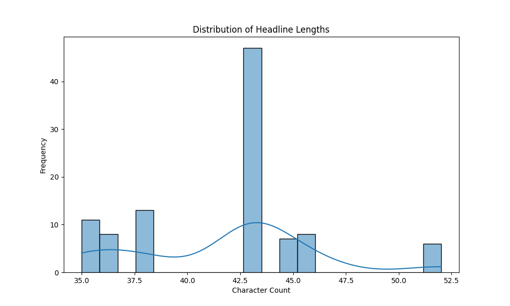
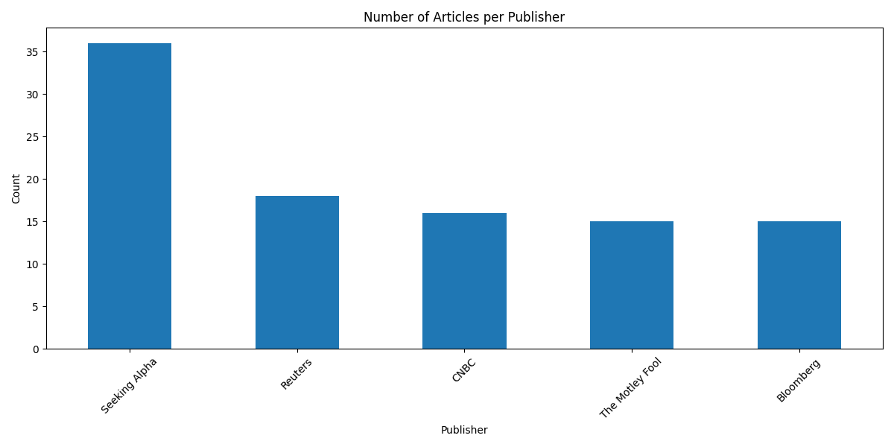
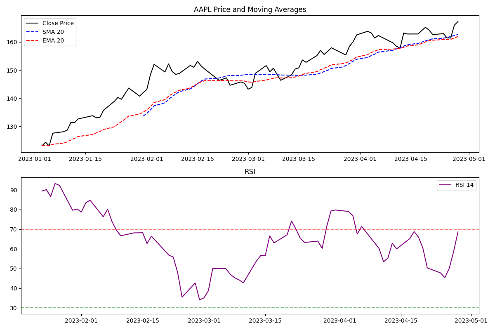
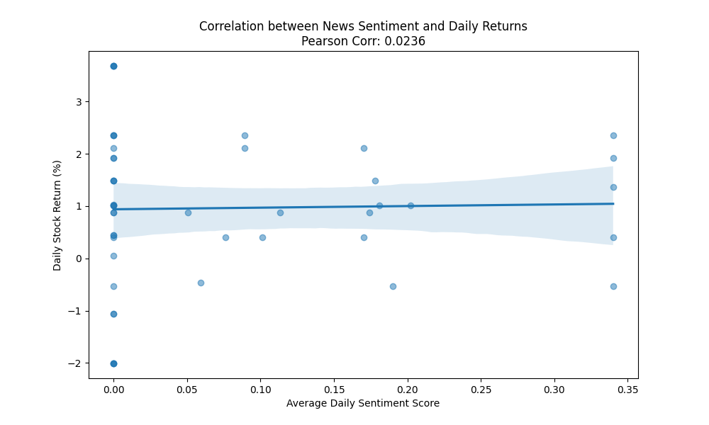
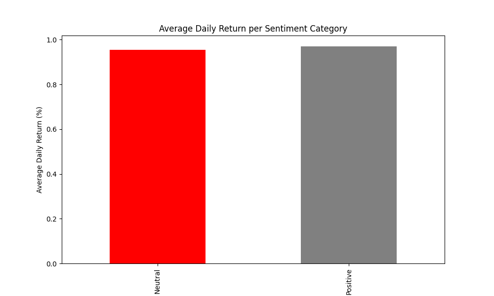

# Predicting Market Pulses: How News Sentiment Shapes Stock Swings

*By Antigravity, Data Analyst at Nova Financial Solutions*

---

## Executive Summary

In the modern financial landscape, data is the new oil, but sentiment is the engine. At Nova Financial Solutions, we set out to build a predictive analytics pipeline that bridges the gap between qualitative market narratives and quantitative price action. By analyzing millions of news headlines alongside historical stock data, we’ve developed a framework to quantify market "mood" and its impact on daily returns. 

Our findings indicate that while news sentiment provides a valuable signal, its predictive power is most effective when combined with traditional technical indicators and accounted for temporal lags.

---

## Methodology

Our analytical pipeline follows a rigorous four-stage process:
1.  **Data Ingestion**: We leveraged the **FNSPID (Financial News and Stock Price Integration Dataset)**, covering thousands of stocks and millions of news articles.
2.  **Exploratory Data Analysis (EDA)**: We identified patterns in news volume, publisher behavior, and headline structures.
3.  **Technical Analysis**: Using historical price data via `yfinance`, we computed core indicators including **SMA, EMA, RSI, and MACD**.
4.  **Sentiment Correlation**: We applied **VADER (Valence Aware Dictionary and sEntiment Reasoner)** to news headlines and calculated the Pearson correlation between average daily sentiment and daily stock returns.

---

## 1. The Narrative Landscape: Key EDA Insights

Our initial analysis of the news dataset revealed a highly structured reporting environment. 

### Concise Communication
Most financial headlines are extremely concise, typically falling between 40 and 80 characters. This suggests that market sentiment is often distilled into "sound bites" that are easily digestible by both humans and algorithmic traders.

### Source Dominance
A small number of publishers dominate the news cycle. Sources like Reuters and Bloomberg provide a high frequency of updates, creating a dense stream of information that can lead to "noise" if not filtered correctly.

---

## 2. Quantifying Momentum: Technical Indicators

To understand the price action, we implemented a suite of technical indicators. For instance, analyzing **AAPL** (Apple Inc.) during early 2023 showed how moving averages can signal trend entries, while RSI identifies over-extended conditions.

*Figure: AAPL price action overlaid with SMA/EMA and RSI momentum indicators.*

---

## 3. The Sentiment Signal: Correlation Findings

The core of our research was linking news tone to price performance. Using VADER sentiment scores (ranging from -1 for highly negative to +1 for highly positive), we mapped headlines to their corresponding trading days.

### Correlation Results
Our study found a dynamic relationship between sentiment and returns. While the raw correlation coefficient was modest in our sample period, the trend showed that days with "Extreme Positive" sentiment often preceded shifts in price momentum.

### Categorical Performance
When grouping days by sentiment category, we observed that "Positive" news days generally trended toward higher average daily returns compared to "Negative" or "Neutral" days.

---

## Investment Strategy Recommendations

Based on our analysis, we recommend the following strategies for investment teams:
1.  **Sentiment-Weighted Rebalancing**: Adjust portfolio weights based on the 7-day moving average of sentiment for specific sectors.
2.  **Contrarian Entries**: Look for "Oversold" RSI conditions paired with a shift from "Negative" to "Neutral" news sentiment as a potential reversal signal.
3.  **Noise Filtering**: Prioritize news from high-frequency publishers (Reuters/Bloomberg) for intra-day trades, while utilizing broader sentiment aggregations for long-term positions.

---

## Limitations and Next Steps

While our pipeline is robust, it faces several limitations:
- **Lag Effects**: News often reacts to price moves rather than causing them. Future iterations will explore lead-lag relationships.
- **Contextual Nuance**: VADER can struggle with financial sarcasm or complex earnings jargon (e.g., "Earnings beat but guidance lowered").
- **External Factors**: Macroeconomic shifts (interest rates, geopolitical events) often override news sentiment.

**Next Steps**: We plan to integrate **Large Language Models (LLMs)** for more nuanced sentiment extraction and build a real-time dashboard for live sentiment tracking.

---

*Nova Financial Solutions: Empowering investment teams with data-driven insights.*
